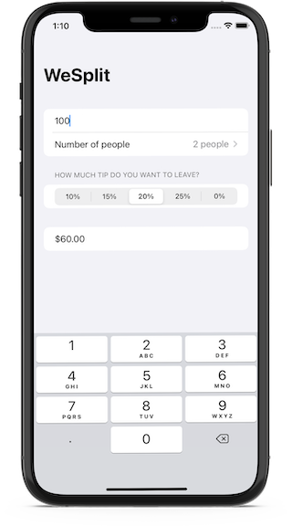

# We Split (SwiftUI)

## Description

WeSplit is an app that you might use after eating at a restaurant - you enter the cost of your food, select how much of a tip you want to leave, and how many people you're with, and it will tell you how much each person needs to pay.

## Screenshot

